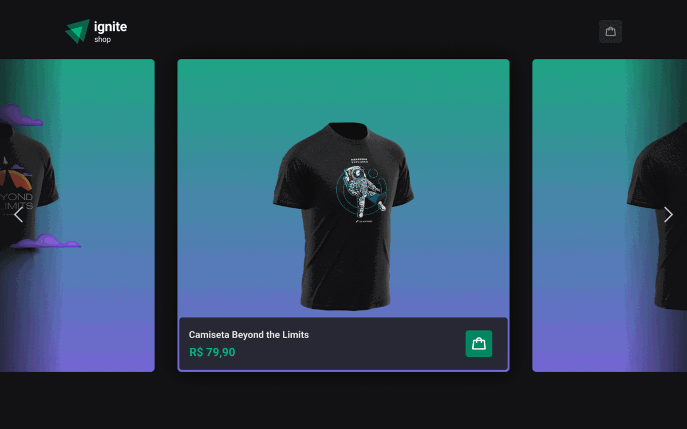

<h1 align="center">
   
</h1>

<p align="center" margin-top="25px" >
  

  

 


  
</p>
___

## 💻 About


In this challenge, a shopping cart was implemented with the option to add and remove items before proceeding to the stripe checkout.
- [x] Adds the possibility to add an item to the cart on the product page
- [x] Save all selected items in the application, and display the number of items in the cart

- [x] Send the cart you have stored in the application to the checkout route, where it will generate the checkout session with the necessary "line_items"

Although there are few features, concepts such as:
- States
- State immutability
- Lists and keys in ReactJS
- Properties
- Componentization
___

## 🛠 Tech Stack

This project was developed with the following technologies:

- [React](https://reactjs.org)
- [Next](https://nextjs.org/)
- [TypeScript](https://www.typescriptlang.org)
- [Stitches](https://stitches.dev/)
- [hot-toast](https://react-hot-toast.com)
- [use-shopping-cart](https://useshoppingcart.com)
- [stripe](https://stripe.com/br)
- [phosphor-react](https://phosphoricons.com/)
- [keen-slider](https://keen-slider.io/)
- [Radix-u](https://www.radix-ui.com/)
- [axios](https://www.axios.com/)
___

## 🔖 Layout
You can view the layout of the project via the link below:

- [Layout Web](https://www.figma.com/file/9jLI50kfFXm1Ol3Q4Kuxyy/Ignite-Shop-2.0-(Copy)?node-id=2%3A12)

## Web

___

## 🚀 How it works

### Pre-requisites
Before you begin, you will need to have the following tools installed on your machine: [Git] (https://git-scm.com), [Node.js] (https://nodejs.org/en/). In addition, it is good to have an editor to work with the code like [VSCode] (https://code.visualstudio.com/)

#### 🧭 Running the web application (Frontend)

```bash
# Clone this repository
$ git clone git@github.com:exodogurgel/ignite-shop.git

# Access the project folder in your terminal
$ cd ignite-shop

# Install the dependencies
$ npm install

# Run the application in development mode
$ npm run dev

# The application will open on the port: 3000 - go to http://localhost:3000
```
___

## 🦸 Author

<a href="https://blog.rocketseat.com.br/author/exodo/">
  
 <br />
 <sub><b>Êxodo Gurgel</b></sub></a> <a href="https://blog.rocketseat.com.br/author/exodo/" title="Rocketseat"></a> 🚀
 <br />

[](https://www.linkedin.com/in/exodo-gurgel/) 
[](mailto:exodowellis@gmail.com)

---

## 📝 License

This project is under the license [MIT](./LICENSE).

Made with ❤️ by Êxodo Gurgel 👋🏽 [Get in Touch!](Https://www.linkedin.com/in/exodo-gurgel/coffee-delivery)

---